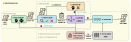

# ConfiBench (AutoBench 3.0)

This is the code implementation of paper ***ConfiBench: Automatic Testbench Generation with Confidence-Based Scenario Mask and Testbench Ensemble using LLMs for HDL Design***, which has been submitted to ***ACM Transactions on Design Automation of Electronic Systems (MLCAD special issue)***. This is the next generation of [CorrectBench](https://github.com/AutoBench/CorrectBench). This is also the third generation of [AutoBench](https://github.com/AutoBench/AutoBench).

This open-sourced project contains the `code implementation` of *ConfiBench*, the `dataset` (see json files in [`data/HDLBits`](data/HDLBits), the dataset is extended from HDLBits data) and the `experimental results` (TODO).
<!-- (see the following google drive link) referred in paper Section IV Experimental results. Due to the large size, the experimental results are uploaded to [google drive](https://drive.google.com/drive/folders/1ldVzdAKC4HQb10ez0aUasNevWnTP5RRc?usp=sharing). -->

## Authors

 - [Ruidi **Qiu**](https://www.ce.cit.tum.de/eda/personen/ruidi-qiu/), Technical University of Munich, r.qiu@tum.de 
 - [Grace Li **Zhang**](https://www.etit.tu-darmstadt.de/fachbereich/professuren_etit/etit_prof_details_121280.en.jsp), TU Darmstadt, grace.zhang@tu-darmstadt.de
 - [Rolf **Drechsler**](https://www.rolfdrechsler.de/), University of Bremen, drechsler@uni-bremen.de
 - [Tsung-Yi **Ho**](https://www.cse.cuhk.edu.hk/people/faculty/tsung-yi-ho/), Chinese University of Hong Kong, tyho@cse.cuhk.edu.hk
 - [Ulf **Schlichtmann**](https://www.ce.cit.tum.de/eda/personen/ulf-schlichtmann/), Technical University of Munich, ulf.schlichtmann@tum.de
 - [Bing **Li**](https://www.eti.uni-siegen.de/dis/mitarbeiter), University of Siegen, bing.li@uni-siegen.de

## What is ConfiBench

*ConfiBench* is an automatic testbench generation framework with functional self-validation, self-correction, masking and testbench ensemble. It is the extended version of [CorrectBench](https://github.com/AutoBench/CorrectBench), and also the third generation of [AutoBench](https://github.com/AutoBench/AutoBench). Utilizing only the RTL specification in natural language, it can validate the correctness of the generated testbenches, perform functional self-correction on the generated testbenches and construct an ensemble of them with effective masks. The comparative analysis demonstrates that our method achieves a pass rate of 72.22% across all evaluated tasks, compared with AutoBench's 52.18\% and a direct LLM-based generation method's 33.33%.

## Setup

### Software

- Python 3.12 or newer.

- The latest version of Icarus Verilog (totally supports ***IEEE Std 1800-2012***). (don't fogget to modify the bin path of iverilog in [iverilog_call.py](iverilog_call.py))

(We strongly recommend utilizing the latest versions of Python and Icarus Verilog. This is due to the fact that higher version expressions employed by LLMs may result in compatibility issues or bugs when executed in older software versions.)

### Python requirements

see [requirements.txt](requirements.txt):

anthropic==0.49.0
loguru==0.7.3
matplotlib==3.10.1
numpy==2.2.3
openai==1.66.3
pandas==2.2.3
PyYAML==6.0.2
Requests==2.32.3
scipy==1.15.2
sympy==1.13.3
tiktoken==0.9.0

### LLM API keys

You must insert your OpenAI/Anthropic API key into [`config/key_API.json`](config/key_API.json) before running the project.

### IVerilog Path

You must change `IVERILOG_PATH` and `IVERILOG_VVP_PATH` in [`iverilog_call`](iverilog_call.py) according to the installation path of iverilog on your device.

### Other Notes

If your CPU is heavily occupied or very inefficient, consider enlarging the value for `timeout` in your config file, otherwise simulation may fail due to too much time spent on simulation and the final performance may decrease.

## Running

This project's config is stored in YAML files under [`/config`](config). You have multiple options to run this project. In addition, a demo has already been generated for your quick check in [`demo`](demo). **This demo is also mentioned by fig.5 in our paper.**

### Run by preset configs

We provided 1 demo for a quick start, you can access them via args:

- quick start single-task demo: `python main.py -c demo`

There are also other full-task preset configs to run the experiments mentioned in the paper. You can check these configs in [`config/configs`](config/configs). If you want to run them, you use the command `python main.py -c` + the config name you want to run. For instance, if you want to run CorrectBench's main experiment in **paper Section IV-B**, you should run the config *config/configs/correctbench.yaml*, then the command will be: `python main.py -c correctbench`.

Here are some experiments and the corresponding command. 

- run ConfiBench on 156 tasks with gpt-4o: `python main.py -c confibench`
- run ConfiBench on 156 tasks with gpt-4omini: `python main.py -c 4omini_confibench`
- run CorrectBench on 156 tasks with gpt-4o: `python main.py -c correctbench`
- run CorrectBench on 156 tasks with gpt-4o-mini: `python main.py -c 4omini_correctbench`
- run AutoBench (a previous LLM-based TestBench generation framework) on 156 tasks with gpt-4o: `python main.py -c autobench`
- run Baseline (a direct LLM-based TestBench generation method) on 156 tasks with gpt-4o: `python main.py -c baseline`

Find more experimental configs in [`config/configs`](config/configs).

### Run by customized configures

You can change the config file at [`config/custom.yaml`](config/custom.yaml) to customized your running. In this way, your command will simply be `python main.py`. Here are explanations for some settings:

#### AutoBench and CorrectBench related:

- `-save-pub-prefix/subdir/dir`: the saving path of log and results. The saving path will be `dir` + `subdir` + `prefix`.

- `-gpt-model`: the LLM model called in work. Now it perfectly supports [OpenAI's conversational LLM models](https://platform.openai.com/docs/models) such as gpt3.5, gpt4, gpt3.5turbo, gpt4turbo, gpt4o, gpt4omini, claude3.5-sonnet. Please use the official model name such as *gpt-4-turbo-2024-04-09* in this option.
  
- `-autoline-probset-only`: this is a list letting the program only run certain tasks. For instance, if I only want to run two tasks: *mux2to1v* and *m2014_q4b*, I should write ['mux2to1v', 'm2014_q4b'] here.
  
- `-autoline-timeout`: Verilog or Python codes that runs longer than this value will be considered as failed because LLM-generated codes may have a finite loop. If your computer is old or heavily occupied, enlarge this value. If too small, some correct codes may be distinguished as failed; if too large, the generated signal file in the infinite loop may be too large to stop your computer.
  
- `-autoline-promptscript`: If you want to run baseline, then `directgen`, otherwise, keep `pychecker`.

- `autoline-save_compile`: default - True; If you do not want the compilation files of Eval2 (more than 100 files per task), set this configuration to False.

- `autoline-probset-more_info_paths`: the pre-generated RTL codes for self-validation. We recommend use the RTL codes from the same LLM as the `gpt-model`. This option aims to improve the speed when you run CorrectBench, but you can also choose to leave this configuration **empty**, that means the imperfect RTLs will be generated while running the self-validator.

- `autoline-TBcheck-rtl_num`: will be activated when there is no pre-generated RTL code provided (see the last configuration). The number of RTLs that will be generated for one task. The default num is 20.

- `autoline-itermax`: the max rebooting iterations used in CorrectBench (parameter *I_R* mentioned in the paper)

- `autoline-TBcheck-correct_max`: the max correction iterations in each rebooting iteration of CorrectBench (parameter *I_C* mentioned in the paper)

- `autoline-TBcheck-discrim_mode`: the validation criterion used in CorrectBench.

#### ConfiBench related:

- `confibench-conf_bool-e_rank_super-threshold`: parameter `T` in Section 4.1.2 (formula 4).

- `confibench-conf_bool-e_rank_super-K`: parameter `K` in Section 4.1.2 (formula 4).

- `confibench-multibench-min_tb`: parameter `En` in Section 4.2.

- `confibench-multibench-min_ratio`: parameter `Er` and `Tr` in Section 4.2.

For other configuration items, please see [default.yaml](config/default.yaml). I would not recommend modifying other configuration items unless you possess sufficient understanding of these components.

## Other Notes

- The circuit_type file in data/HDLBits is only for reference but not used in our work. In ConfiBench workflow, the circuit type of each task is discriminated in Stage 0.

- During its development phase, the validator (CorrectBench) is also called "discriminator", so you will see a lot of "disc" in our codes, which represent discrimination.

## License

To do in the future

## Reference

Will be available after acception.
